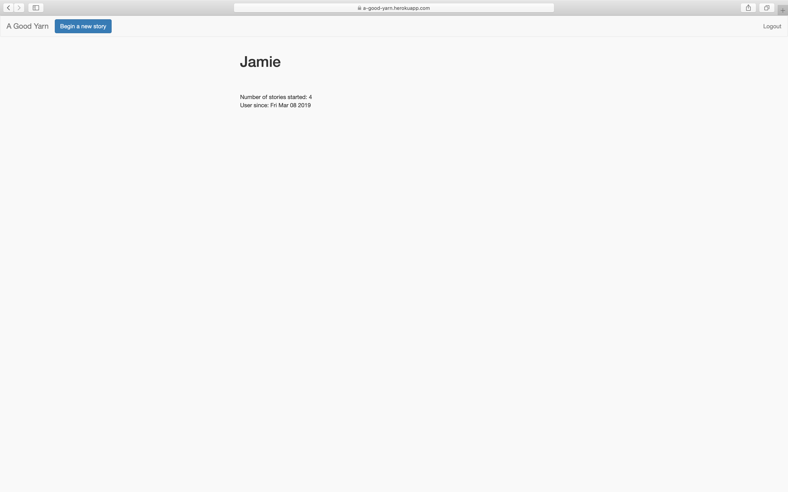
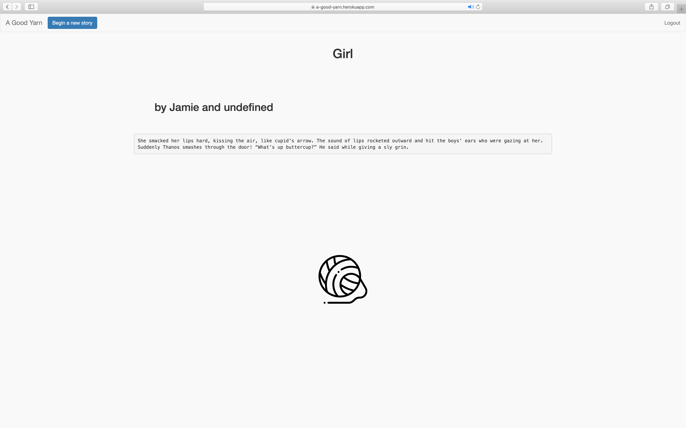
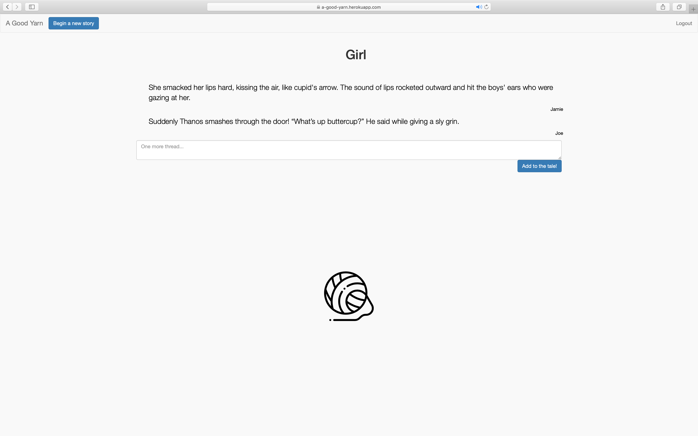

This is the final project for my backend web class (BEW1.2) at Make School, San Francisco.

The purpose of this project was to create a RESTful API using MVC 'architecture' that makes use of secure log-in/log-out features, has more than 1 nested route, and has CRUD-able resources.

I decided to build a "shared-story platform" called "Yarn" that allows users to post story-starters or "starters" that then can be added to by the same user or other users. These additions to the story, I decided to call "threads".

To use the app, navigate in your browser to:

https://a-good-yarn.herokuapp.com.

If you'd like to contribute to this project. Feel free to reach out to me via email at jamie.mccrory@students.makeschool.com, especially if you are a frontend developer! I have some ideas for how I would like the site to look.

Below I will give an explanation of some of the API's more-useful routes.

LOOK UP A USER PROFILE:

https://a-good-yarn.herokuapp.com/user-profile/:userId

If you would like to view user stats, please enter their user Id after 'user-profile/'
A user's Id can be found in the url after first navigating to their profile page by clicking on the hyperlink of their name. Only the authors of story-starters are hyperlinked (on the index page after logging-in).

VIEW STORY IN READER-MODE:

https://a-good-yarn.herokuapp.com/starters/:starterId/yarn

If you would like to view a story in a more readable format, enter the Id of the story-starter followed by '/yarn'. The starter Id can be found in the url after first navigating to the story. You can also click on the yarn icon at the bottom of the story screen to view the story in reader mode.

Reader-view

Accessible by clicking on the yarn icon.

In future releases, knowing usernames and story titles will be enough to navigate to their respective pages as both are unique values. (Story titles cannot be the same as a pre-existing story title, the same for usernames and pre-existing usernames.)
